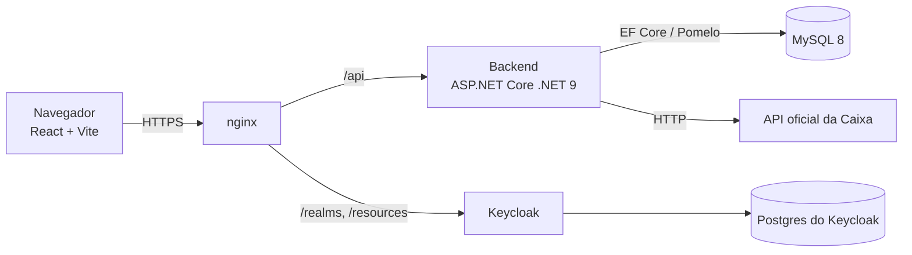
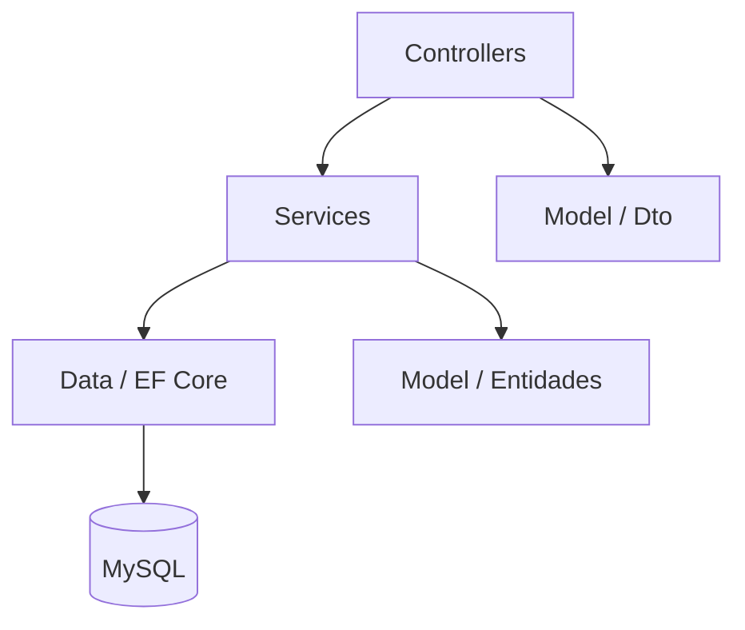
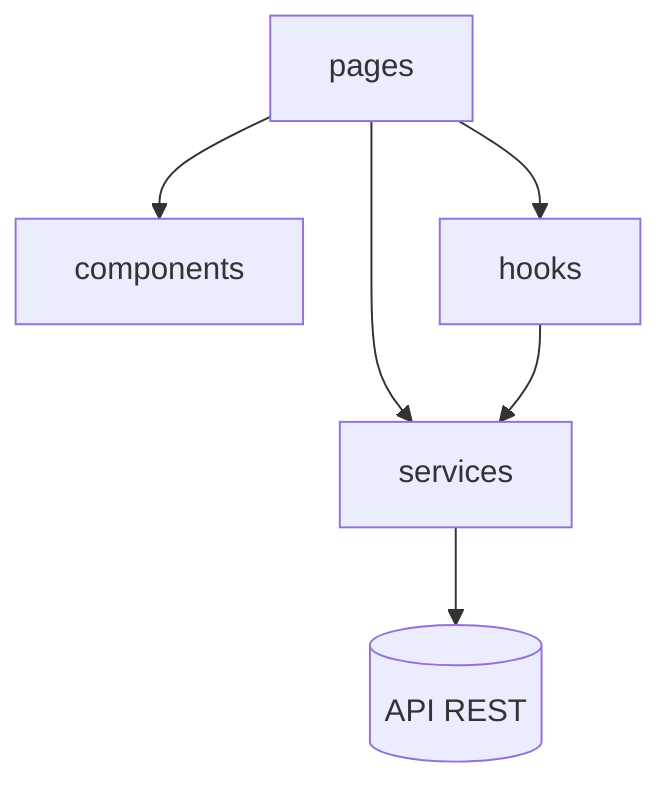
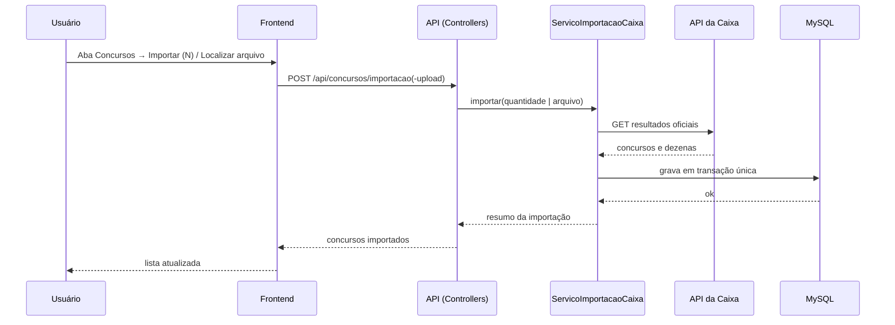
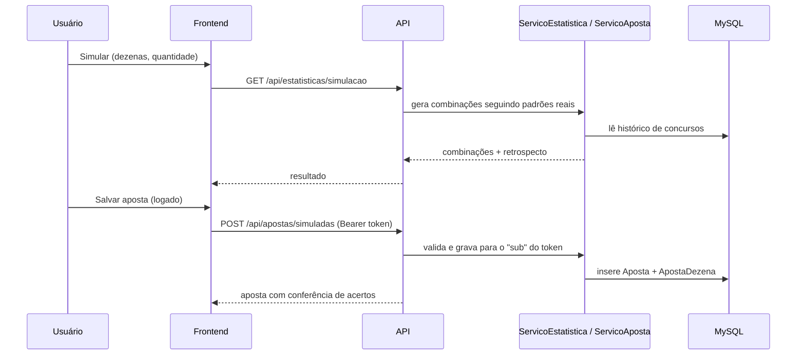
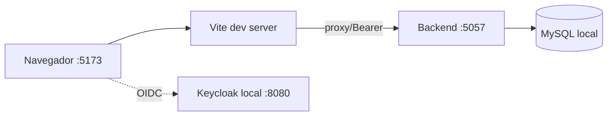
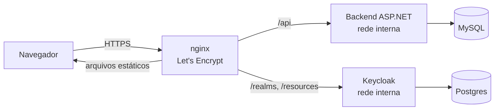

# Arquitetura

Documento de arquitetura do Análise Jogos Caixa: camadas, padrões de projeto,
decisões, fluxos principais e ambientes. Descreve a solução sem expor as regras
de negócio implementadas no repositório privado.

> **Contexto:** projeto de estudo para **levar uma aplicação full stack à
> nuvem**. O tema (Mega Sena) é o pretexto para exercitar modelagem de dados,
> API REST, SPA, autenticação, deploy e operação — ver
> [Propósito de aprendizado](#propósito-de-aprendizado).

## Visão geral

Aplicação web em duas camadas, com autenticação delegada a um provedor OIDC e
persistência relacional.

| Componente | Responsabilidade                                                        |
|------------|-------------------------------------------------------------------------|
| Frontend   | SPA React que consome a API e conduz o login OIDC                        |
| nginx      | TLS, arquivos estáticos do frontend e proxy de `/api`, `/realms`, `/resources` |
| Backend    | API REST: importação, estatísticas, apostas e doação                     |
| MySQL      | Concursos, dezenas sorteadas e apostas dos usuários                      |
| Keycloak   | Identidade, cadastro, login e emissão dos tokens                         |

## Camadas

### Backend (ASP.NET Core)

- **Controllers** — expõem os endpoints REST e a autorização (`[Authorize]` nas
  rotas de aposta). Não contêm regra de negócio.
- **Services** — concentram a regra: importação da Caixa, importação de planilha,
  estatística, aposta e doação.
- **Data** — `DbContext` (EF Core + Pomelo) e migrations versionadas.
- **Model** — entidades (`Concurso`, `ConcursoDezena`, `Aposta`, `ApostaDezena`)
  e DTOs de entrada/saída, mantendo a API desacoplada das entidades.

### Frontend (React + TypeScript)

- **pages** — uma página por funcionalidade (dashboard, concursos, estatísticas,
  simulação, validação, apostas).
- **components** — elementos reutilizáveis (menu de autenticação, doação Pix).
- **hooks** — estado de autenticação por cima do `keycloak-js`.
- **services** — cliente HTTP (`api.ts`) e configuração do Keycloak
  (`autenticacao.ts`). O token é injetado apenas nas rotas autenticadas.
- **types.ts** — tipos TypeScript que espelham os DTOs da API.

## Padrões de projeto

Padrões usados de forma pragmática: o objetivo é deixar cada responsabilidade
em um lugar previsível, sem cerimônia que não traga benefício.

### Backend (.NET)

| Padrão | Onde aparece | Para que serve |
|--------|--------------|----------------|
| **Injeção de dependência** | `Program.cs` registra serviços e `DbContext`; controllers e serviços recebem as dependências pela própria assinatura | Inverte o controle da criação dos objetos e permite variar a configuração por ambiente |
| **Camadas / Service Layer** | `Controllers` (HTTP) → `Services` (regra) → `Data` (persistência) | Separa protocolo, regra de negócio e acesso a dados |
| **DTO** | `Model/Dto` | A API expõe contratos próprios; as entidades do banco não vazam na resposta |
| **Repository + Unit of Work** | os `DbSet` do EF Core funcionam como repositórios e `SaveChangesAsync` como unidade de trabalho | Encapsula o acesso ao MySQL e concentra a consistência em uma operação |
| **Transação explícita** | `ImportarStream`: `BeginTransaction` com `Commit`/`Rollback` em `try/catch/finally` | Garante que a importação inteira grave ou nada |
| **Middleware (pipeline)** | `app.Use(...)` de erro global, além de `UseCors`, `UseAuthentication` e `UseAuthorization` | Trata exceções em um único ponto devolvendo JSON e garante a ordem correta do pipeline |
| **Adapter** | `AddJwtBearer` integrando o Keycloak (OIDC) | Adapta um provedor externo de identidade à autenticação do ASP.NET Core |
| **Strategy** | backtest comparando "Mais sorteadas", "Mais atrasadas", "Simulador ponderado" e "Aleatória (controle)" sob a mesma contagem de acertos | Mede estratégias no mesmo cenário; hoje são vetores e índices, e podem evoluir para classes |
| **Builder** | `ServicoDoacao.MontarBrCode` monta o BR Code campo a campo (TLV) e fecha com CRC16 | Constrói um payload de estrutura fixa passo a passo |
| **Projeção / Data Mapper** | consultas com `Select(...)` direto para o DTO | Lê do banco apenas o necessário, sem carregar entidades |
| **Guard clause** | `ServicoAposta.ValidarDezenas` lança `ArgumentException`, traduzida em HTTP 400 pelo controller | Valida na entrada e devolve erro claro |
| **Migrations** | `Data/Migrations` | Versiona o esquema do banco junto com o código |

### Frontend (React + TypeScript)

| Padrão | Onde aparece | Para que serve |
|--------|--------------|----------------|
| **Custom Hook** | `useAutenticacao` | Encapsula estado, efeitos e ciclo de vida da autenticação |
| **Observer** | `observarAutenticacao` mantém um conjunto de ouvintes notificados quando o token muda | Desacopla o serviço de autenticação dos componentes |
| **Singleton preguiçoso** | uma única instância de `Keycloak` e a promessa `inicializacao` reaproveitada | Evita inicializações concorrentes e estado duplicado |
| **Decorator (wrapper)** | `requisicaoAutenticada` envolve `requisicao` e injeta o `Bearer` | Adiciona autenticação sem repetir código em cada chamada |
| **Módulo de serviço** | `services/api.ts` e `services/autenticacao.ts` exportam funções | Concentra o acesso à API e ao provedor de identidade |
| **Composição de componentes** | `App` orquestra as páginas; `components/` guarda os reutilizáveis | Mantém a interface montável e de leitura simples |
| **Máquina de estados simples** | união de tipos `Pagina` + renderização condicional | Navegação explícita sem dependência de roteador |
| **Autorização na UI (gatekeeping)** | itens de menu filtrados por perfil e checagem de login antes de navegar | Melhora a experiência; a autorização real acontece no backend |

### Princípios

- **Responsabilidade única:** cada serviço cuida de um assunto — importar da
  Caixa, importar planilha, calcular estatística, gerir apostas e montar a
  doação.
- **Injeção de dependência sim, interfaces ainda não:** os serviços são
  injetados como classes concretas; extrair interfaces é a evolução natural
  para testes e substituições.
- **Idioma do domínio:** entidades, DTOs, métodos e mensagens em pt-BR.

## Decisões de arquitetura

| # | Decisão | Motivo |
|---|---------|--------|
| 1 | **Backend separado do frontend** (API REST + SPA) | Permite evoluir a interface e a API de forma independente e manter a regra de negócio fora do bundle público. |
| 2 | **Delegar identidade ao Keycloak (OIDC)** | O projeto não armazena senhas; cadastro, confirmação de e-mail, MFA e futuros provedores sociais ficam no provedor. |
| 3 | **Aposta associada ao `sub` do token** | Identidade do usuário sem duplicar tabela de usuários no domínio. |
| 4 | **Validação do JWT no backend** | As rotas de aposta não confiam no frontend: a autorização é verificada onde o dado é gravado. |
| 5 | **Chave Pix apenas no backend** | O backend monta o BR Code e expõe só o QR; a chave não vai para o bundle do frontend. |
| 6 | **Importação com busca binária na API da Caixa** | O endpoint da Caixa não informa o último concurso; a busca descobre o número atual. Gravação em transação única. |
| 7 | **Importação por planilha via upload multipart** | O navegador não expõe o caminho real do arquivo; o upload é o caminho funcional para o histórico completo. |
| 8 | **Backtest walk-forward com controle aleatório** | Mede as regras em concursos fora da amostra e contra um baseline, evitando conclusões por ajuste ao passado. |
| 9 | **Tudo em pt-BR no domínio** | Nomes de entidades, DTOs e mensagens seguem o idioma do produto. |
| 10 | **TLS e proxy no nginx** | Backend, banco e Keycloak ficam em rede interna; só o nginx é exposto. |

## Fluxos

### Importação de concursos

### Simulação e conferência de apostas

## Ambientes

### Local

### Produção

- Um único domínio com HTTPS serve frontend, API e Keycloak (o último apenas por
  rotas de proxy).
- Banco e Keycloak não têm porta exposta publicamente.
- O endereço público da instância é mantido por DDNS com um timer do `systemd`.

## Configuração

Valores sensíveis **nunca** ficam no código ou no repositório; vêm de variáveis
de ambiente. Somente os nomes são documentados:

| Variável | Uso |
|----------|-----|
| `ANALISE_JOGOS_CAIXA_CONNECTION` | Conexão com o MySQL |
| `ANALISE_JOGOS_CAIXA_AUTENTICACAO_URL` | URL do Keycloak para o backend |
| `ANALISE_JOGOS_CAIXA_AUTENTICACAO_REALM` | Realm OIDC |
| `ANALISE_JOGOS_CAIXA_AUTENTICACAO_CLIENTE_ID` | Audience/cliente do token |
| `ANALISE_JOGOS_CAIXA_CHAVE_PIX` | Chave Pix usada para montar o BR Code |
| `VITE_AUTENTICACAO_URL` / `VITE_AUTENTICACAO_REALM` / `VITE_AUTENTICACAO_CLIENTE_ID` | Configuração OIDC do frontend |

## Segurança

- O repositório público **não contém** código-fonte, credenciais, strings de
  conexão, domínios internos nem dados de usuários.
- O token OIDC é mantido apenas em memória no frontend e validado no backend.
- A doação Pix é montada no servidor; a chave não é embutida no bundle.
- Nenhum endpoint administrativo ou de reset de senha é exposto publicamente.

## Propósito de aprendizado

O projeto existe para **aprender a colocar uma aplicação full stack na nuvem**
— do banco à tela, passando por autenticação, deploy e operação. O tema da Mega
Sena é o pretexto para exercitar um ciclo completo de desenvolvimento, e não uma
tentativa de prever sorteios.

O que foi praticado:

- **Modelagem de dados** relacional com migrations versionadas.
- **API REST** em .NET organizada em camadas, com DTOs, tratamento de erro
  centralizado e rotas autenticadas.
- **SPA** em React consumindo a API e conduzindo o login OIDC.
- **Identidade** delegada a um Keycloak próprio — a aplicação não guarda senhas.
- **Deploy em nuvem (AWS EC2)** com nginx como proxy reverso e HTTPS via
  Let's Encrypt.
- **Operação:** serviço mantido pelo `systemd`, atualização de IP por DDNS,
  backup antes do deploy e segredos apenas em variáveis de ambiente.
- **Custo:** infraestrutura enxuta e doação Pix voluntária para o break-even.

A escolha de manter a aplicação em uma EC2, em vez de um PaaS, foi deliberada:
o objetivo é entender na prática as peças que normalmente ficam escondidas —
proxy reverso, certificado, serviços do sistema, processo de publicação e
configuração por ambiente.
