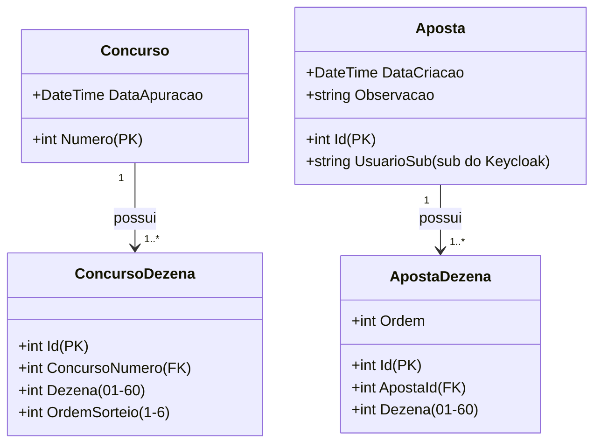
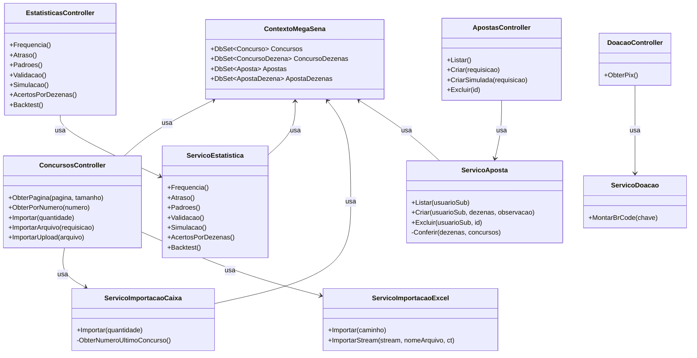
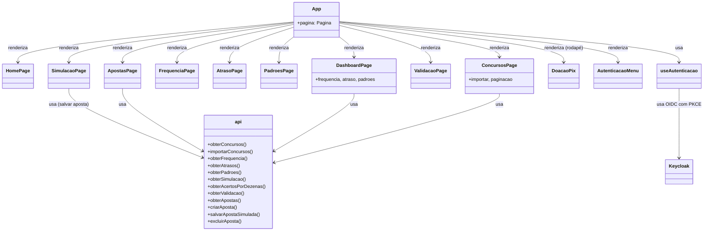
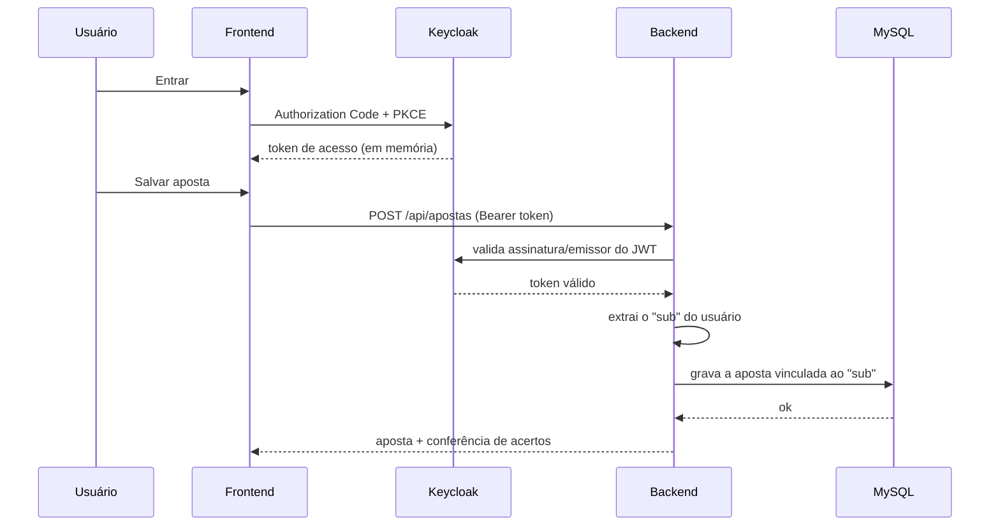

# UML

Diagramas do Análise Jogos Caixa (Mermaid). Mostram as entidades, as classes
principais de cada camada e o relacionamento entre elas, sem detalhar a
implementação.

## Modelo de dados

## Backend

## Frontend

## Autenticação e aposta

