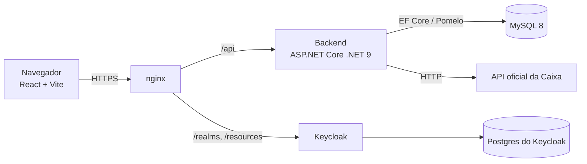
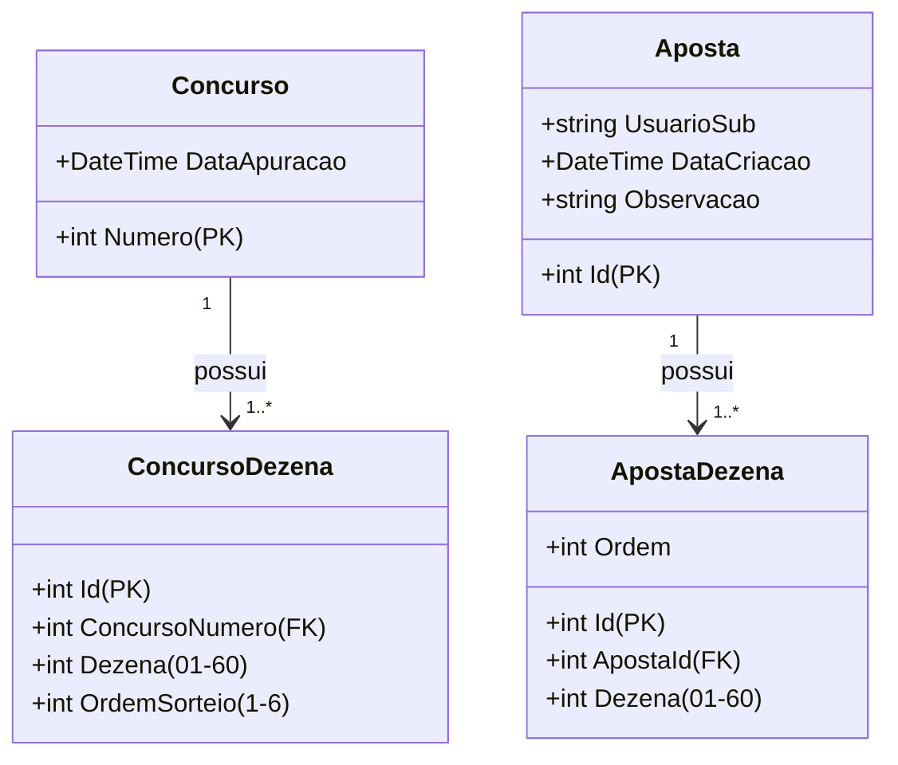

# Análise Jogos Caixa

Aplicação web de **análise estatística da Mega Sena**: importa os resultados
oficiais da Caixa, calcula estatísticas (frequência, atraso, padrões, validação
por qui-quadrado, simulação e backtest) e permite registrar e conferir apostas
por usuário autenticado.

> **Este repositório é a vitrine do projeto.** O código-fonte é privado; aqui
> ficam públicos apenas a ideia, a arquitetura, o modelo de dados e a estrutura
> de pastas — sem as regras de negócio.

**Aplicação publicada:** `https://analisejogoscaixa.ddns.net`

## Objetivo

Gerar **estatísticas** sobre os sorteios — e não prever ou descobrir os números
do próximo concurso. Todo sorteio é independente e cada combinação tem a mesma
probabilidade; as análises (frequência, atraso, simulação, backtest e validação)
existem para entender o comportamento dos sorteios, confirmar que as
distribuições seguem o acaso e mostrar que nenhuma regra de escolha de dezenas
aumenta a chance de ganhar. O que muda a probabilidade é apenas a quantidade de
dezenas por combinação (cobertura).

## Propósito de aprendizado

Projeto de estudo para **levar uma aplicação full stack à nuvem**: backend,
frontend, banco, autenticação, deploy e operação. O tema é o pretexto para
exercitar o ciclo completo — modelagem de dados com migrations, API REST em
.NET, SPA em React, login OIDC com Keycloak, nginx + HTTPS numa EC2 da AWS,
serviço no `systemd`, DDNS, backup e segredos em variáveis de ambiente.

Arquitetura, **padrões de projeto** e decisões estão em
[`Docs/ARQUITETURA.md`](Docs/ARQUITETURA.md).

## Funcionalidades

- **Importação** dos resultados oficiais, pelos últimos N concursos ou pelo
  histórico completo enviado em planilha `.xlsx`.
- **Frequência** por dezena (01–60), com as mais e menos sorteadas.
- **Atraso** atual por dezena, média histórica e maior atraso registrado.
- **Padrões**: pares/ímpares, soma média e dezenas repetidas entre concursos.
- **Validação**: teste qui-quadrado de uniformidade e distribuições reais
  comparadas às teóricas.
- **Simulação** de combinações de 6 a 15 dezenas, com retrospecto de acertos
  contra todo o histórico.
- **Acertos por quantidade de dezenas**: média empírica de cada tamanho de jogo.
- **Backtest walk-forward**: regras de escolha (mais sorteadas, mais atrasadas,
  simulador) comparadas a um controle puramente aleatório.
- **Autenticação OIDC** (Keycloak) para as rotas do usuário.
- **Minhas Apostas**: registrar apostas manualmente ou salvar combinações da
  simulação, com conferência de acertos contra o histórico.
- **Doação voluntária via Pix** (modelo break-even), com o QR Code montado no
  backend.

## Stack

| Camada   | Tecnologia                                                |
|----------|-----------------------------------------------------------|
| Backend  | ASP.NET Core Web API (.NET 9) + EF Core + Pomelo (MySQL)  |
| Banco    | MySQL 8                                                   |
| Frontend | React 19 + Vite + TypeScript                              |
| Auth     | Keycloak (OIDC, Authorization Code + PKCE)                |
| Dados    | API oficial da Caixa (dados públicos)                     |

## Arquitetura



Camadas, padrões de projeto, decisões e fluxos em
[`Docs/ARQUITETURA.md`](Docs/ARQUITETURA.md).

## Modelo de dados



## Endpoints da API

| Método | Rota                                        | Descrição                                                     |
|--------|---------------------------------------------|---------------------------------------------------------------|
| GET    | `/api/concursos`                            | Lista paginada de concursos                                   |
| GET    | `/api/concursos/{numero}`                   | Busca concurso pelo número                                    |
| POST   | `/api/concursos/importacao`                 | Importa os últimos N concursos da Caixa                        |
| POST   | `/api/concursos/importacao-arquivo`         | Importa o histórico a partir de um `.xlsx` no servidor         |
| POST   | `/api/concursos/importacao-upload`          | Importa o histórico por upload multipart de `.xlsx`            |
| GET    | `/api/estatisticas/frequencia`              | Frequência por dezena (01–60)                                 |
| GET    | `/api/estatisticas/atraso`                  | Atraso atual, média histórica e maior atraso                  |
| GET    | `/api/estatisticas/padroes`                 | Pares/ímpares, soma média e dezenas repetidas                 |
| GET    | `/api/estatisticas/validacao`               | Qui-quadrado de uniformidade e distribuições reais vs. teóricas |
| GET    | `/api/estatisticas/simulacao`               | Combinações simuladas (6–15 dezenas) + retrospecto            |
| GET    | `/api/estatisticas/acertos-por-dezenas`     | Média empírica de acertos por tamanho de jogo                 |
| GET    | `/api/estatisticas/backtest`                | Backtest walk-forward contra controle aleatório               |
| GET    | `/api/apostas`                              | Lista as apostas do usuário logado, com conferência           |
| POST   | `/api/apostas`                              | Cria uma aposta manual (6–15 dezenas) — exige login            |
| POST   | `/api/apostas/simuladas`                    | Salva uma combinação gerada na simulação — exige login         |
| DELETE | `/api/apostas/{id}`                         | Exclui uma aposta do usuário logado                           |
| GET    | `/api/doacao/pix`                           | BR Code (QR Code Pix) para doação voluntária                   |

As rotas `/api/apostas*` exigem token OIDC (`Authorization: Bearer <token>`) e
são escopadas pelo `sub` do token. As rotas de estatísticas e concursos são
públicas.

## Autenticação

O login é delegado a um **Keycloak** (realm `suite-autenticacao`), com fluxo
Authorization Code + PKCE. O frontend guarda o token apenas em memória; o
backend valida o JWT e associa cada aposta ao identificador (`sub`) do usuário.
O Análise Jogos Caixa **não recebe nem armazena senhas**.

## Estrutura

Árvore completa (sem o conteúdo dos arquivos) em
[`Docs/ESTRUTURA.md`](Docs/ESTRUTURA.md). Resumo:

```
AnaliseJogosCaixa/
├── backend/AnaliseJogosCaixa.Api/   # Web API: Controllers, Model, Data, Services
└── frontend/src/                    # SPA React: pages, components, hooks, services
```

## Produção

Deploy em uma instância EC2 (Amazon Linux 2023): nginx com HTTPS (Let's Encrypt)
servindo o frontend estático e fazendo proxy do backend e do Keycloak; banco
MySQL e Keycloak sem exposição pública de portas. Detalhes em
[`Docs/ARQUITETURA.md`](Docs/ARQUITETURA.md).

## Documentação

- [Arquitetura, padrões de projeto e decisões](Docs/ARQUITETURA.md)
- [UML](Docs/UML.md)
- [Estrutura de pastas](Docs/ESTRUTURA.md)

## Avisos legais

- "Mega Sena" é marca registrada da Caixa Econômica Federal; o projeto usa o nome
  apenas de forma descritiva e educativa, sem afiliação ou endosso.
- Os resultados dos sorteios são dados públicos (Lei 13.756/2018), usados aqui
  para fins educacionais e estatísticos, sem fins comerciais.
- O projeto não prevê resultados nem garante ganhos; participe com
  responsabilidade e apenas se tiver mais de 18 anos.
